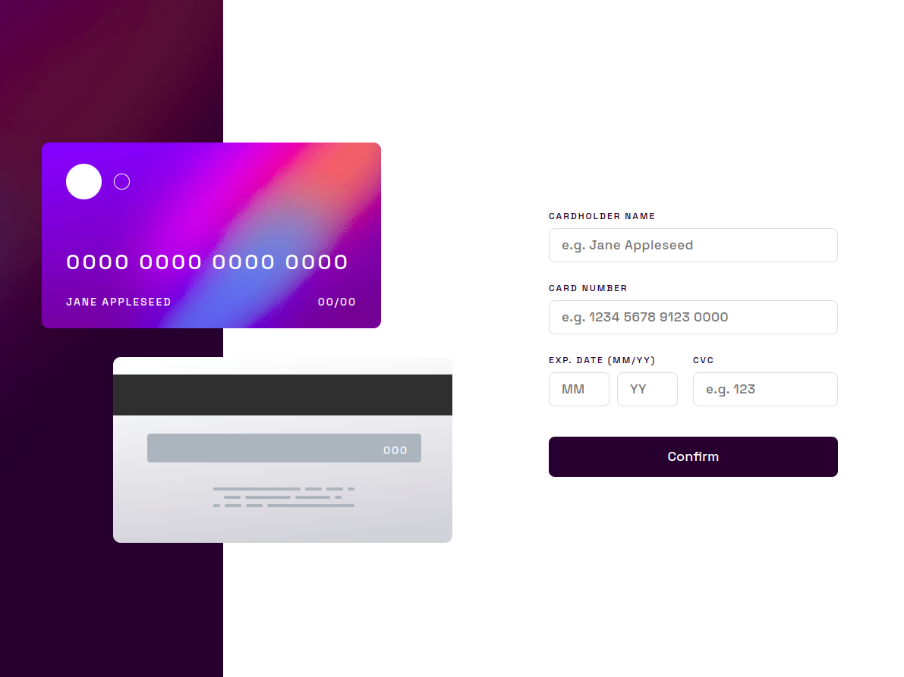
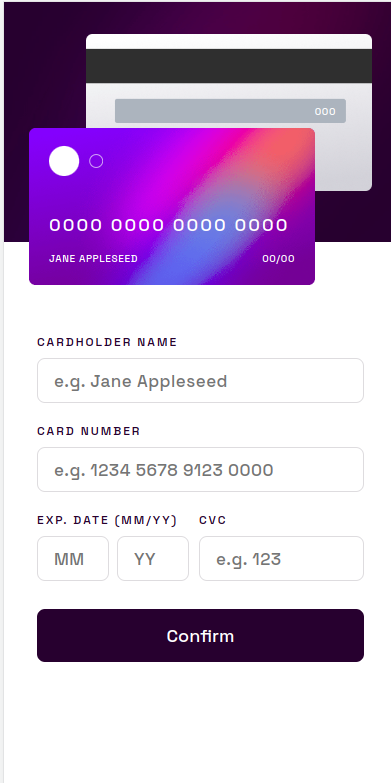

# Frontend Mentor - Interactive card details form solution

This is a solution to the [Interactive card details form challenge on Frontend Mentor](https://www.frontendmentor.io/challenges/interactive-card-details-form-XpS8cKZDWw). Frontend Mentor challenges help you improve your coding skills by building realistic projects. 

## Table of contents

- [Overview](#overview)
  - [The challenge](#the-challenge)
  - [Screenshot](#screenshot)
  - [Links](#links)
- [My process](#my-process)
  - [Built with](#built-with)
  - [What I learned](#what-i-learned)
  - [Continued development](#continued-development)
  - [Useful resources](#useful-resources)
- [Author](#author)

## Overview

### The challenge

Users should be able to:

- Fill in the form and see the card details update in real-time
- Receive error messages when the form is submitted if:
  - Any input field is empty
  - The card number, expiry date, or CVC fields are in the wrong format
- View the optimal layout depending on their device's screen size
- See hover, active, and focus states for interactive elements on the page

### Screenshot

### Links

- Solution URL: [solution URL](https://github.com/HeloisaSantos20/desafiosFrontendMentor/tree/main/InteractiveCardDetailsForm)
- Live Site URL: [live site URL](https://heloisasantos20.github.io/desafiosFrontendMentor/InteractiveCardDetailsForm/)

## My process

### Built with

- JavaScript 
- DOM Manipulation
- DOM Events
- Form data validation
- Responsive Web Design
- Semantic HTML5 markup
- CSS custom properties
- Flexbox

### What I learned

This was undoubtedly my biggest challenge so far, and I put in a lot of effort and studying to accomplish it. My greatest difficulties and biggest learning experiences were with DOM manipulation and events in JavaScript. It took me several days to complete this project, but now that I have learned more, I will be faster on other sites. I now have more confidence and knowledge to undertake new web projects.

### Continued development

I will continue to deepen my knowledge in Javascript, especially in events and DOM manipulation. I am also starting to learn about React, and in my next project, I plan to use an API.

### Useful resources

- [Events](https://developer.mozilla.org/pt-BR/docs/Learn/JavaScript/Building_blocks/Events) - This content has helped me a lot in regards to DOM events.
- [Form data validation](https://developer.mozilla.org/pt-BR/docs/Learn/Forms/Form_validation) - I learned from this content how to validate my form.

## Author

- Frontend Mentor - [@HeloisaSantos20](https://www.frontendmentor.io/profile/HeloisaSantos20)

