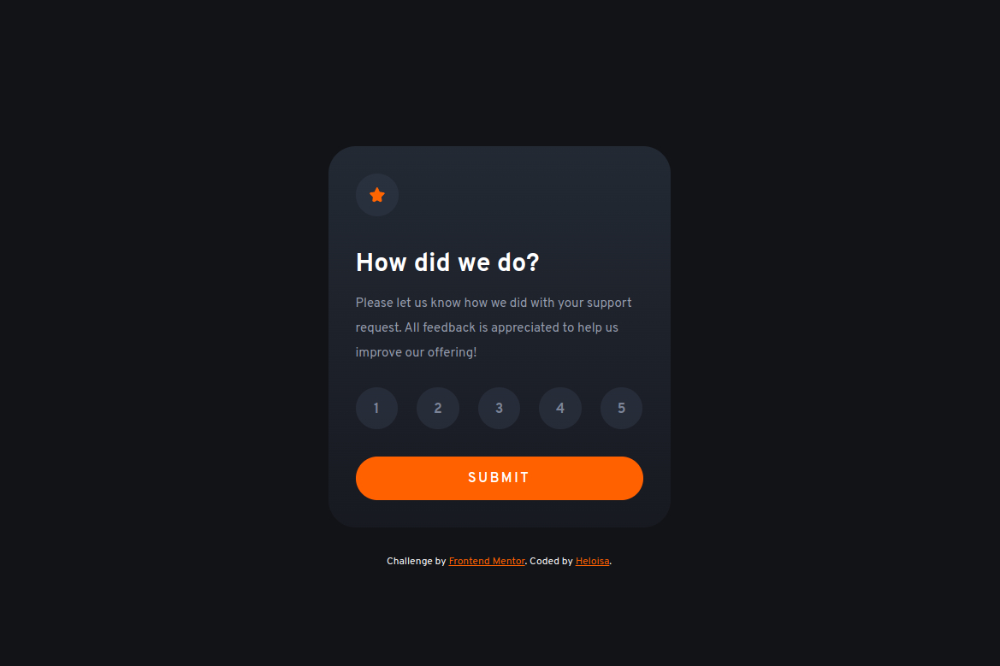

# Frontend Mentor - Interactive rating component solution

This is my solution to the [Interactive rating component challenge on Frontend Mentor](https://www.frontendmentor.io/challenges/interactive-rating-component-koxpeBUmI). Frontend Mentor challenges help you improve your coding skills by building realistic projects. 

## Table of contents

- [Overview](#overview)
  - [The challenge](#the-challenge)
  - [Screenshot](#screenshot)
  - [Links](#links)
- [My process](#my-process)
  - [Built with](#built-with)
  - [What I learned](#what-i-learned)
- [Author](#author)

## Overview

### The challenge

Users should be able to:

- View the optimal layout for the app depending on their device's screen size
- See hover states for all interactive elements on the page
- Select and submit a number rating
- See the "Thank you" card state after submitting a rating

### Screenshot

### Links

- Solution URL: [Add solution URL here](https://github.com/HeloisaSantos20/desafiosFrontendMentor/tree/main/InteractiveRatingComponent)
- Live Site URL: [Add live site URL here](https://heloisasantos20.github.io/desafiosFrontendMentor/InteractiveRatingComponent/)

## My process

### Built with

- JavaScript
- CSS custom properties
- Flexbox
- HTML

### What I learned

I learned to better organize my code, to be more agile, and while visualizing the project's design, already thinking of strategies to implement it. An important thing to note is that this was my first project with Javascript. I tried to do it in the best possible way, but I believe I can still improve a lot.

## Author

- Frontend Mentor - [@HeloisaSantos20](https://www.frontendmentor.io/profile/HeloisaSantos20)